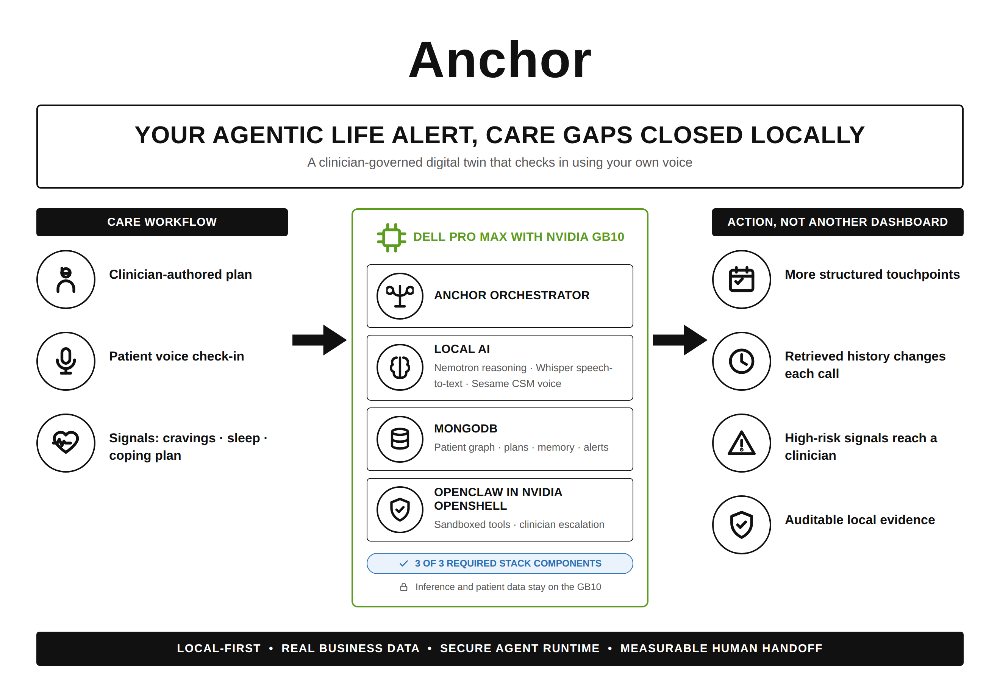
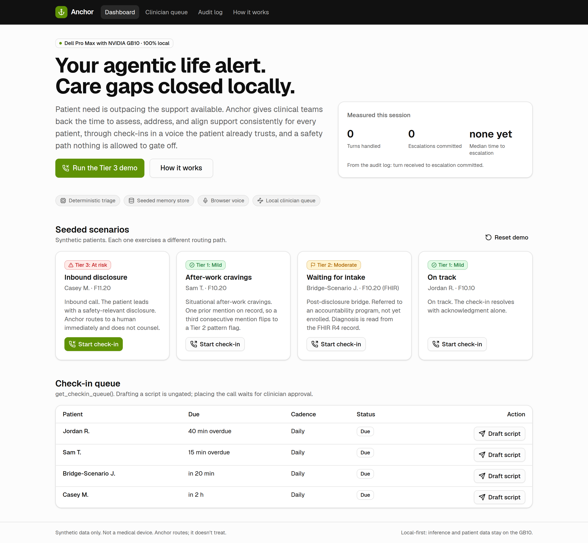
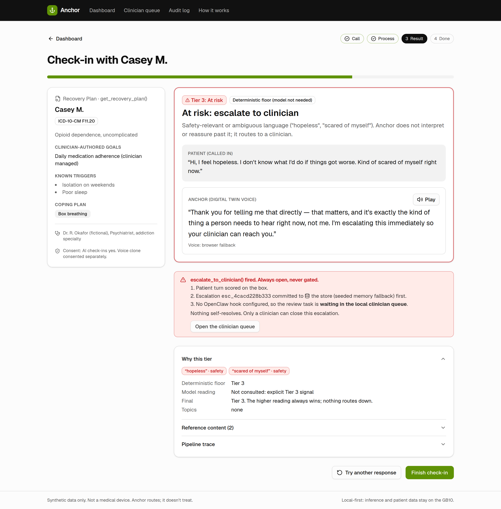
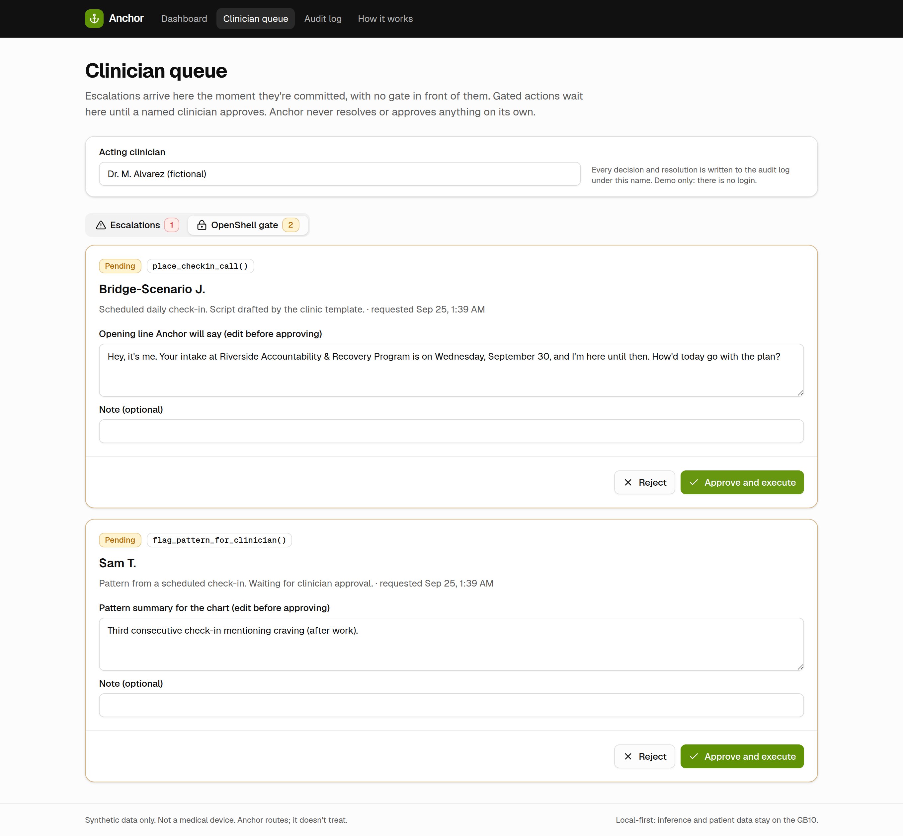
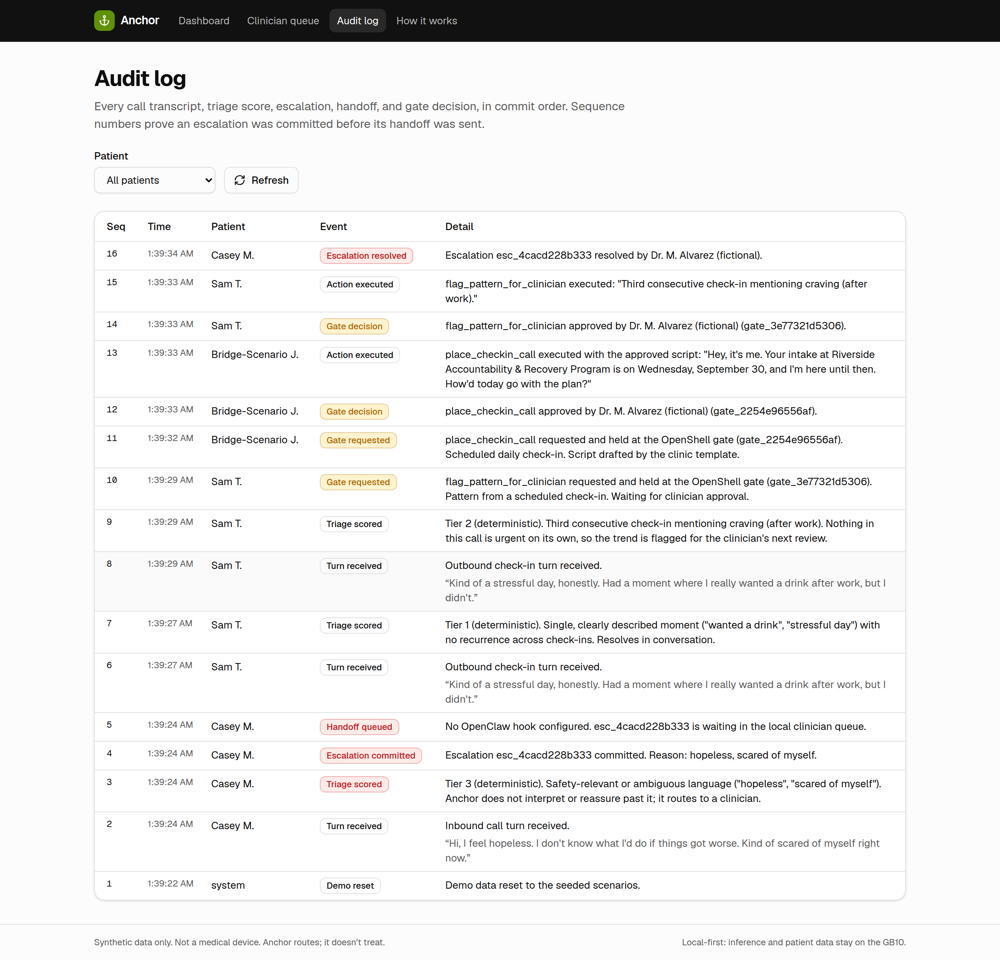

# Anchor

**Your agentic life alert. Care gaps closed locally.**

Anchor is a clinician-governed digital twin that checks in with people in substance use disorder recovery, in a voice they already trust. It classifies every response on the box, routes anything concerning to a clinician immediately, and runs 100% locally on a Dell Pro Max with NVIDIA GB10. Built at, and winner of, the Dell x NVIDIA AI Hackathon NYC.



## Problem

Patient need is outpacing the support available. Clinical teams get pulled into routine monitoring instead of practicing at the top of their license, and that gap is where safety risk lives: the patient nobody had time to check on twice. The riskiest stretch is the wait between a disclosure and a first treatment appointment, when nothing is watching.

## User

Two people share every check-in. The **patient** in recovery, often in a bridge period before program intake, talks to Anchor. The **clinician** authors the Recovery Plan, approves anything Anchor wants to do, and owns every escalation.

## Solution

Anchor runs the routine check-ins and routes each response into one of three tiers. Its governing rule is simple: on any doubt, route up, never down.

| Tier | Trigger | Action | Gated? |
|---|---|---|---|
| 1. Mild | A single, clearly described moment | Resolve in conversation, with clinic-vetted coping content if relevant | No |
| 2. Moderate | The same issue across three consecutive check-ins, or a goal missed more than once | `flag_pattern_for_clinician()` | OpenShell gate |
| 3. At risk | Any safety-relevant disclosure, or anything too ambiguous to classify | `escalate_to_clinician()` | **Never** |

Safety properties, each enforced by a test:

- Escalation is never gated and never waits on the reasoning model.
- The escalation is committed to MongoDB before a bounded review task is sent to OpenClaw. The sandbox is compute, not custody.
- The model can raise a tier above the deterministic floor, never lower it.
- Anchor's Tier 3 replies are vetted lines, used verbatim. Crisis resources are attached for the clinician and never read aloud.
- Only a named clinician can approve a gated action or resolve an escalation.

## Demo

There's no hosted demo yet. Run it locally (below) and click **Run the Tier 3 demo**. The script is in [`docs/demo-script.md`](docs/demo-script.md).

## Screenshots

| Dashboard | Tier 3 result |
|---|---|
|  |  |
| **OpenShell gate** | **Audit log: commit before handoff** |
|  |  |

## Architecture

```
Check-in Queue (MongoDB) ─┐                     ┌─ Tier 1: vetted reply, coping content
Inbound call ─ OpenClaw ──┼─ get_recovery_plan ─┤  Tier 2: flag_pattern_for_clinician ─ OpenShell gate ─ clinician
                          │   classify on GB10  │  Tier 3: commit to MongoDB ─ OpenClaw hook ─ clinician queue
                          │   (floor + model)   └─ Audit Log (every step, in commit order)
propose_checkin_script ─ OpenShell gate ─ place_checkin_call
```

One patient turn runs through `src/lib/pipeline/checkin.ts`: read the plan (ungated tools), classify (deterministic floor in `src/lib/triage/engine.ts`, then the local model through `src/lib/ai/provider.ts`), commit, then route through the tools in `src/lib/tools/index.ts`. Every adapter has a fallback, so the demo runs anywhere and switches to the GB10 through environment variables.

## Stack

| Layer | Choice |
|---|---|
| App | Next.js 16 (App Router), TypeScript, Tailwind CSS 4, shadcn/ui on Radix, Zod, Sonner, Lucide |
| System of record | MongoDB (`src/lib/store/mongo.ts`), with a seeded in-memory fallback |
| Reasoning | Any OpenAI-compatible server on the GB10. Default model: Qwen 3.8 27B |
| Voice | Kokoro TTS on the GB10, falling back to the browser's speech synthesis; browser dictation for input |
| Orchestration and control | OpenClaw hook for escalation handoff; the OpenShell gate for `place_checkin_call` and `flag_pattern_for_clinician` |
| Interoperability | FHIR R4 crosswalk for the bridge patient; ICD-10-CM coding |
| Tests | Vitest (unit and MongoDB integration), Playwright walkthrough |

## Local setup

Requires Node 20.9 or newer.

```bash
npm install
npm run dev            # http://localhost:3000
npm test               # unit tests; MongoDB integration tests run when MONGODB_URI is set
npm run lint && npm run typecheck
```

On the GB10, run the app with MongoDB via Docker; see [`docs/DEPLOY_GB10.md`](docs/DEPLOY_GB10.md). To exercise every live adapter path without the box, run `npm run mock:gb10` and point the env vars at it.

## Environment variables

All are optional. With none set, Anchor uses deterministic triage, the seeded memory store, and the browser voice. See [`.env.example`](.env.example).

| Variable | Purpose |
|---|---|
| `MONGODB_URI`, `MONGODB_DB` | System of record |
| `ANCHOR_LLM_BASE_URL`, `ANCHOR_LLM_MODEL`, `ANCHOR_LLM_API_KEY`, `ANCHOR_LLM_TIMEOUT_MS` | Local reasoning model |
| `ANCHOR_TTS_BASE_URL`, `ANCHOR_TTS_MODEL`, `ANCHOR_TTS_VOICE` | Kokoro voice |
| `OPENCLAW_HOOK_URL`, `OPENCLAW_HOOK_TOKEN` | Authenticated escalation handoff |
| `ANCHOR_DEMO_MODE` | Set to `false` to disable the reset button |

## Demo scenarios

All patients are synthetic.

| Patient | Scenario | What it shows |
|---|---|---|
| Casey M. | Inbound disclosure | The patient calls in and leads with a safety disclosure. Tier 3, no gate, commit before handoff. |
| Sam T. | After-work cravings | A second craving resolves with urge surfing. A third consecutive one becomes a Tier 2 flag held at the gate. |
| Bridge-Scenario J. | Waiting for intake | Diagnosis read from a FHIR R4 bundle. A drafted check-in script waits for clinician approval. |
| Jordan R. | On track | Acknowledgment only. |

The check-in screen also offers the nine vetted lines from [`docs/triage-dialogue-examples.md`](docs/triage-dialogue-examples.md).

## Limitations

- Synthetic data only. Not a medical device, and no HIPAA compliance claim.
- Calls are simulated in the browser; there's no telephony.
- No authentication. The clinician name is typed in and written to the audit log.
- Keyword triage is a floor, not a classifier. Without a model, anything unrecognized escalates, which is safe but noisy.
- The MongoDB adapter is covered by integration tests in CI, not in the sandbox this was built in.
- The original build plan and data-store package were lost after the hackathon. [`docs/BUILD_PLAN.md`](docs/BUILD_PLAN.md) is a reconstruction.

## Roadmap

- Resolve Recovery Plans live from FHIR `CarePlan`
- Telephony for real inbound and outbound calls
- Inbound onboarding: referral ingestion and consented voice capture for the Digital Twin
- Embedding retrieval over a larger reference library
- Authentication, roles, and per-clinic tenancy
- Clinical validation of the triage rules with a care team

## Team

Built at the Dell x NVIDIA AI Hackathon NYC by Rex Belgarde, Jai, and Anthony (reunited former Cityblock Health teammates) with four new teammates, including Sai and Yash. *(Add full names and roles.)*

## Docs

- [`docs/BUILD_PLAN.md`](docs/BUILD_PLAN.md): scope, phases, and judge Q&A
- [`docs/triage-logic.md`](docs/triage-logic.md): the three tiers and their rules
- [`docs/triage-dialogue-examples.md`](docs/triage-dialogue-examples.md): vetted example exchanges
- [`docs/inbound-outbound.md`](docs/inbound-outbound.md): data flow and contracts
- [`docs/demo-script.md`](docs/demo-script.md): the 35-second Tier 3 demo and pitch
- [`docs/DEPLOY_GB10.md`](docs/DEPLOY_GB10.md): running on the box
